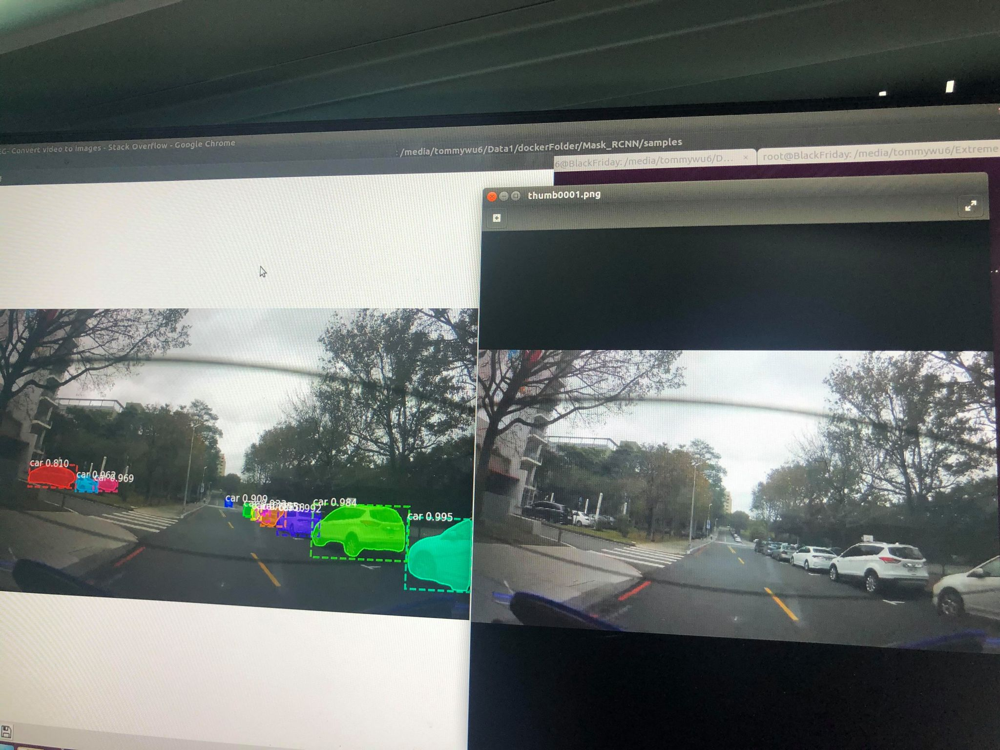

# Mask R-CNN for Object Detection and Segmentation

This is an implementation of [Mask R-CNN](https://arxiv.org/abs/1703.06870) on Python 3, Keras, and TensorFlow. The model generates bounding boxes and segmentation masks for each instance of an object in the image. It's based on Feature Pyramid Network (FPN) and a ResNet101 backbone


lack of coco and coco api, and mask_rcnn_coco.h5 file





### Installation

```
pip3 install -r requirements.txt
python3 setup.py install

```


### COCO api install

```
git clone https://github.com/cocodataset/cocoapi
cd coco/PythonAPI
# 要用python or python3 當作指令，請依照自己的環境喔。
python setup.py build_ext --inplace
python setup.py build_ext install


https://blog.csdn.net/mdjxy63/article/details/81146964
```


